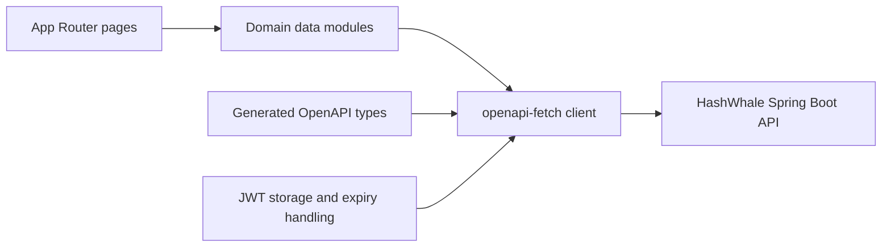

# HashWhale Web

Next.js frontend for HashWhale, a simulated digital-asset wallet, Earn, and collateralized-borrowing application. It consumes the [hashwhale-core](https://github.com/donum01/hashwhale-core) REST API and presents real database-backed account activity without moving real cryptocurrency.

## Highlights

- Responsive dashboard, Wallet, Borrow, and Earn experiences
- Typed API client generated from the backend OpenAPI contract
- JWT authentication and centralized session-expiry handling
- Persistent light and dark themes
- Live portfolio summaries and locally cached market-price charts
- Review-and-confirm steps for financial operations
- Accessible validation, status messaging, and loading states
- Explicit simulation labels for deposits, withdrawals, and Earn activity

## Technology

- Next.js 16.3.3 with the App Router
- React 19
- TypeScript 5.7
- Tailwind CSS 4
- Base UI and shadcn components
- `openapi-fetch` and `openapi-typescript`
- Lucide icons

## Routes

| Route | Purpose |
| --- | --- |
| `/` | Registration and login |
| `/dashboard` | Account overview, alerts, recommendations, and market chart |
| `/wallet` | Balances, simulated deposits and withdrawals, and activity history |
| `/borrow` | Loan creation, LTV preview, active loans, and repayment |
| `/earn` | Product subscription, account summary, positions, and withdrawals |

The `/_not-found` route shown during `next build` is Next.js's built-in unmatched-route page. The `○` marker means the page shell is statically prerendered; authenticated data is still loaded from the protected backend at runtime.

## Architecture



- `lib/api.ts` creates the shared client, attaches the bearer token, and handles expired sessions.
- `lib/api-schema.d.ts` is generated from the backend's OpenAPI document.
- `lib/wallet.ts`, `lib/borrow.ts`, `lib/earn.ts`, and `lib/dashboard.ts` map API responses into UI-facing models.
- Components never receive JPA entities; the backend contract consists entirely of DTOs.

## Local setup

### Prerequisites

- Node.js 20 or newer
- npm
- [hashwhale-core](https://github.com/donum01/hashwhale-core) running at `http://localhost:8080`

### 1. Install dependencies

```powershell
npm install
```

### 2. Configure the API URL

Create `.env.local` in the repository root:

```dotenv
NEXT_PUBLIC_API_URL=http://localhost:8080
```

`.env.local` is ignored by Git.

### 3. Start development mode

```powershell
npm run dev
```

Open `http://localhost:3000`.

## Production build

```powershell
npm run build
npm run start
```

The production build performs the primary TypeScript and Next.js validation for this repository.

## Regenerating the API contract

Start the backend, then run:

```powershell
npx openapi-typescript http://localhost:8080/v3/api-docs -o lib/api-schema.d.ts
```

Regenerate the schema whenever a backend endpoint or DTO changes. This makes breaking contract changes visible as frontend TypeScript errors.

## Authentication behavior

- Registration and login are public backend operations.
- Protected page data requires a valid JWT.
- The API client attaches `Authorization: Bearer <token>` automatically.
- A `401 Unauthorized` response clears the local credentials, redirects to login, and displays a session-expired message.
- Theme preference is stored independently and remains stable while navigating.

The JWT is currently stored in `localStorage` for demo simplicity. A production application should generally prefer an `httpOnly`, secure, same-site cookie with an appropriate CSRF design to reduce token exposure to injected scripts.

## Demo workflow

The backend repository includes an opt-in seeder that creates a realistic showcase account with reconciled Wallet, Borrow, Earn, and transaction records. From `hashwhale-core`, run:

```powershell
.\scripts\reset-demo-data.ps1
```

Then sign in on this frontend using `demo@hashwhale.com` and the password entered into the script.

## Scope and limitations

- Financial actions are simulations recorded in the application database.
- There is no blockchain wallet integration or real asset custody.
- There is no refresh-token flow; an expired 24-hour token requires another login.
- Authenticated data is fetched client-side rather than rendered on the server.
- Market-chart freshness follows the backend collector interval rather than a trading-grade real-time feed.
- KYC processing is unavailable in the demo.

## License

See [LICENSE](LICENSE).
